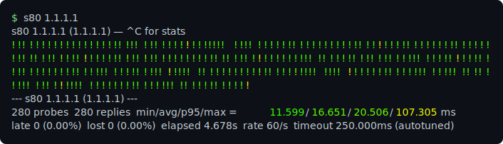

# s80

Terminal-native ping tool. Sibling of [s80](https://s80.me)

I fell in love with the fast pinger on Cisco gear ~2004 when I worked at a cable ISP. Being able to send potentially hundreds of icmp packets per second made stuttery latency really obvious. This led me to create the web-based tool [s80](https://s80.me). But I've worked on this thing for so long, I've added a lot of cool stuff that was never present in the original cisco ping tool (namely color). The stream of !!!!!! coming out of the cisco pinger let you see the latency as it happens, but once it outputs them the information is lost. The color lets you see the whole picture at once.




## How it works

**Native ICMP/udp ping tool** It does not call the system ping tool but directly
generates and times packets. It only sends a second packet when the first one
comes back or times out, so it will not DOS or flood networks. The packet rate
scales with the speed of the network. If you ping localhost, you might see 100k
packets per second, or only 1-2 pps over satellite. Also, even if you set a 
very low timeout, it automatically scales the timeout if everything is timing
out to avoid a flood. Sending a lot of pings is fine as long as you are responsible
about it.

**Glyphs.**

- `!` — reply, colored on a log-scale wheel from blue (µs territory) through
  green (~1 ms) to red (~1.5 s). Above 1 ms the colors match s80.me exactly so
  results are somewhat comparable.
- `.` — timeout
- `,` — late: the reply arrived *after* its timeout. The `.` is repainted in
  place if still on screen, and always tallied separately. Late vs lost is the
  difference between queueing/retry disease and vanished-packet disease —
  serial probing makes the distinction unambiguous.

**Adaptive timeout.** 4 × the recent p95 RTT, clamped to 250 ms – 2 s. A drop
on a 5 ms path shouldn't blind the stream for a fixed 2 seconds. `-T` only
sets the starting value: while probes time out the timeout grows, so a short
`-T` can't turn the self-clock into a fixed-rate flood; once replies flow it
re-anchors to the path. The footer reports where it settled.

**It owns the socket.** ICMP echo via unprivileged datagram sockets — native
on macOS, and on Linux this normally works out of the box too: systemd has
shipped `ping_group_range` wide-open by default since 2018 (Debian 13,
Ubuntu, Fedora, Arch). Never shells out to `ping`.

Where that default is absent (unprivileged containers silently drop it,
hardened kernels), either restore it or use UDP mode, which needs no
privileges anywhere:

```
sudo sysctl -w net.ipv4.ping_group_range='0 65535'
s80 -u <target>
```

To make it persistent across reboots:

```
echo 'net.ipv4.ping_group_range = 0 65535' | sudo tee /etc/sysctl.d/99-unprivileged-ping.conf
```

No raw sockets, no setuid, no capability bits: This was a design requirement.
It isn't reasonable for a ping tool to ask for root.

**UDP mode** (`-u`) probes like traceroute does: a datagram to a closed high
port (default 33434) draws an ICMP port-unreachable from the target. On a
connected UDP socket that arrives as `ECONNREFUSED` — a round-trip proof
needing no raw socket and no privileges at all. It's a nice fallback if
ICMP is ignored/blocked.


## Install

### Linux

Any x86_64 distro — the binary is fully static. Works in WSL too.

```
curl -L https://github.com/cartossin/s80-cli/releases/latest/download/s80-Linux-x86_64.tar.gz | tar xz
sudo mv s80 /usr/local/bin/
```

### macOS

Apple Silicon:

```
curl -L https://github.com/cartossin/s80-cli/releases/latest/download/s80-Darwin-arm64.tar.gz | tar xz
sudo mv s80 /usr/local/bin/
```

### From source

```
cargo build --release   # Rust 1.82+
```

## Usage

```
s80 [options] <target>

  -c, --count <n>     stop after n probes (default 1000; 0 = unlimited)
  -t, --secs <n>      stop after n seconds instead (0 = unlimited)
  -d, --delay <ms>    delay between probes in milliseconds
  -T, --timeout <ms>  starting probe timeout (autotuned during the run)
  -u, --udp           use UDP probes instead of ICMP
      --port <n>      UDP destination port (default 33434)
      --color <when>  auto | always | never
      --256           force 256-color palette
```

**Spaced probes read slower — that's real.** With `-d`, RTTs rise (on some
machines several-fold): between probes the CPU downclocks, caches cool, and
the kernel's hot path goes cold, so each spaced probe pays wake-up costs a
back-to-back probe doesn't. The system's own `ping -i 1` shows it worse.
Dense probing measures your best case; spaced probing measures what
intermittent traffic actually experiences. Both are true.

Output is pipeable: when stdout isn't a tty, ANSI is dropped
(`s80 gw | tee incident.log`).

## Build

```
cargo build --release   # → target/release/s80
```

Two dependencies (socket2, libc). 

## Roadmap


- Per-hop mode: mtr-style TTL probing, one tick strip per hop,
  I think I need to do some work to understand the nuances of traceroutes before
  trying to write my own one; but the visual would be super cool and an mtr killer.
- IPv6 probably? does anyone care about this??

## License

MIT
